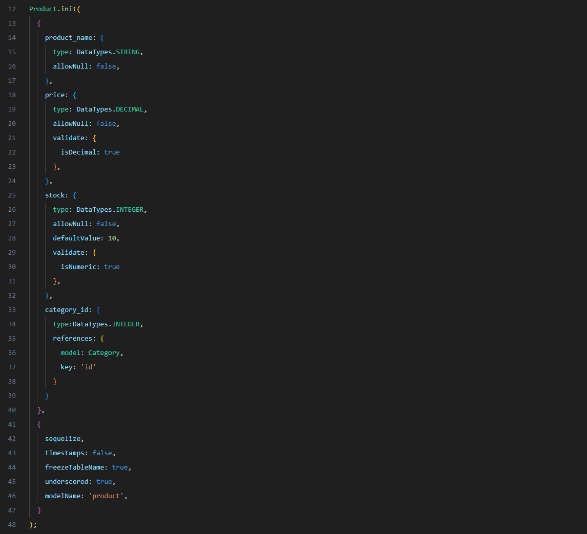
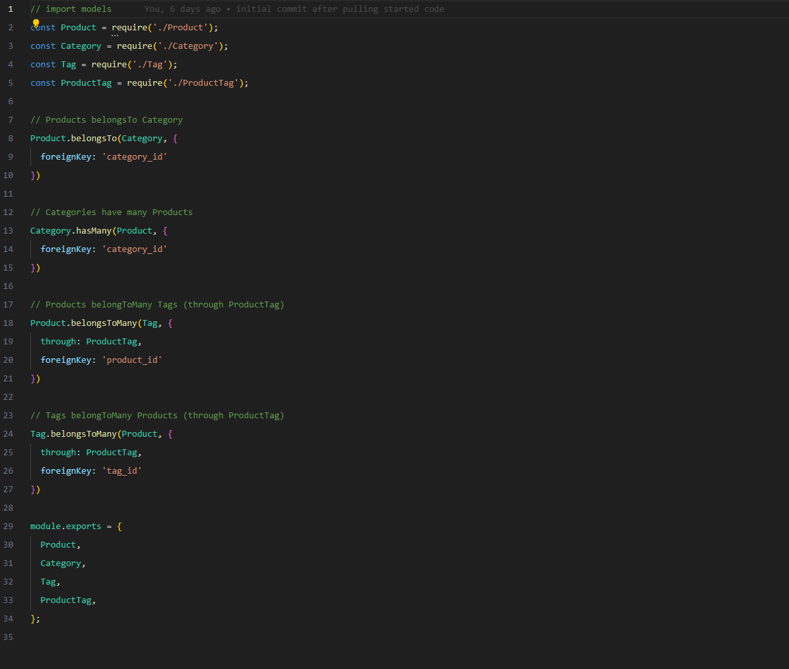
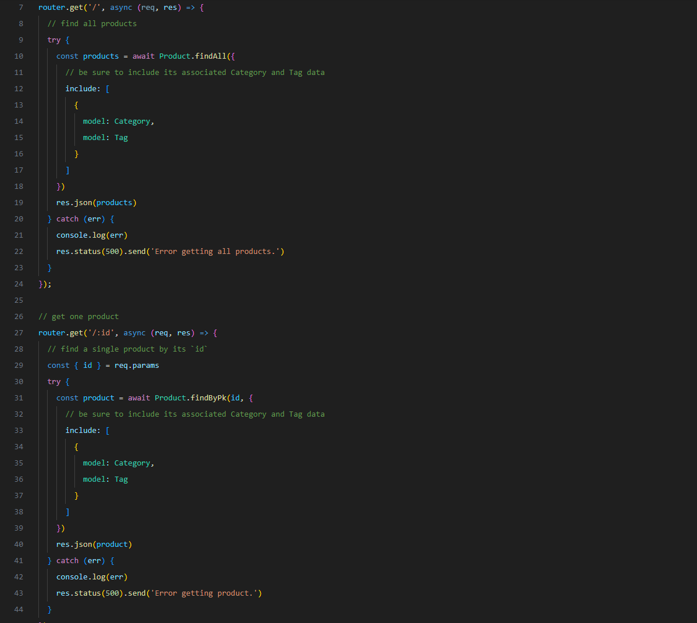

# 13-oh-our-emmy-commerce

## Description

This is a project for UW in which we were asked to create the back end for an e-commerce website using object relational mapping through the sequelize package.  Products can be added, updated or removed from a database using API routes.

## Installation

This app uses PostgreSQL to store and interact with the database.

Pull the contents of this repo into a local directory. Navigate to the directory and type ```npm install``` into the command line to install npm packages. 

## Usage
Type ```psql -U postgres``` into the command line and log into PostgreSQL. An example .env package provided will allow you to input your login information. 

Type ```npm run seed``` into the command line to seed the database with the provided products. 

Type ```npm start``` into the command line to start the server. 

Product Model using Sequelize



Index of Models



Example of API Route to Get All Products



Routes Tested in Insomnia


Link to video of app in use: https://drive.google.com/file/d/1D4eSxyF6YF0ubp03szDWFWD7YZ7Yk-UV/view


## License

N/A

## Questions

Any questions about this application should be directed to:

GitHub: https://github.com/ktunebe

Email: ktunebe@gmail.com